---
## From Events to Alerts

First, an event must occur, it can be anything like an user login, process launch or file download. Then, the system is logs the event and then it must be shipped to an security solution such as an SIEM or EDR. Alerts are automated notifications that saves time of a SOC Analyst, which is a huge improvement in efficiency.
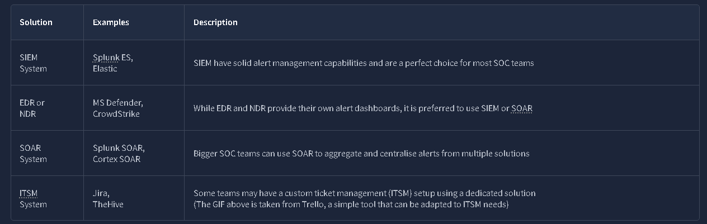
## L1 Role in Alert Triage

SOC L1 are the first in line. But the levels are doing different stuff, such as:

- **SOC L1 analysts:**  Review the alerts, distinguish bad from good, and notify L2 analysts in case of a real threat
- **SOC L2 analysts:**  Receive the alerts escalated by L1 analysts and perform deeper analysis and remediation
- **SOC engineers:**  Ensure the alerts contain enough information required for efficient alert triage
- **SOC manager:**  Track speed and quality of alert triage to ensure that real attacks won't be missed

QUESTIONS:

**What is the number of alerts you see in the SOC dashboard?**

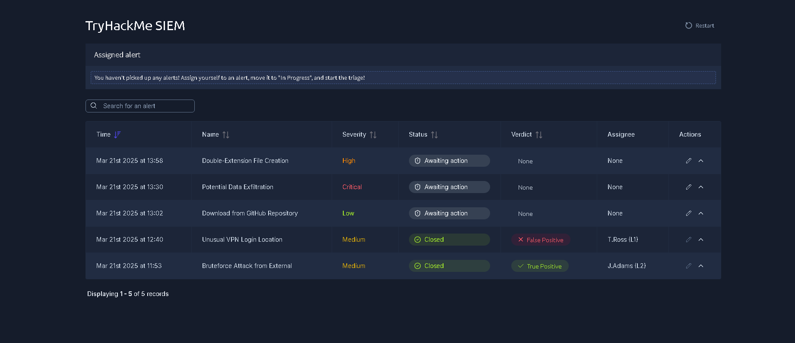
**Answer**: 5

 **What is the name of the most recent alert you see?**
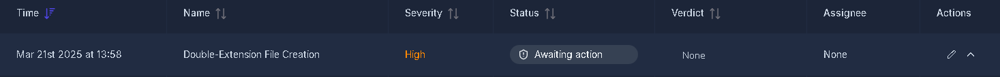

Filter by date => **Answer: Double-Extension File Creation**

## ALERT PROPERTIES
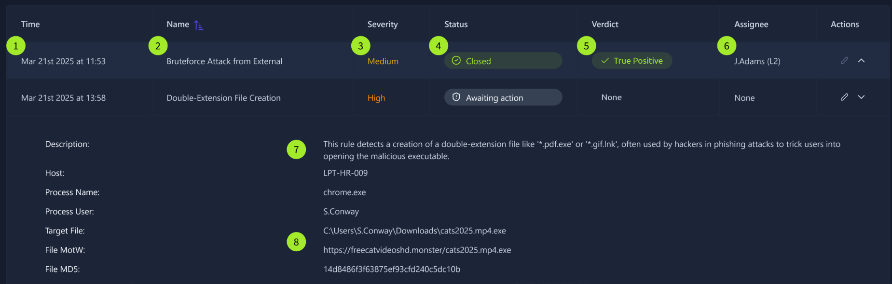
 **Alert Properties**
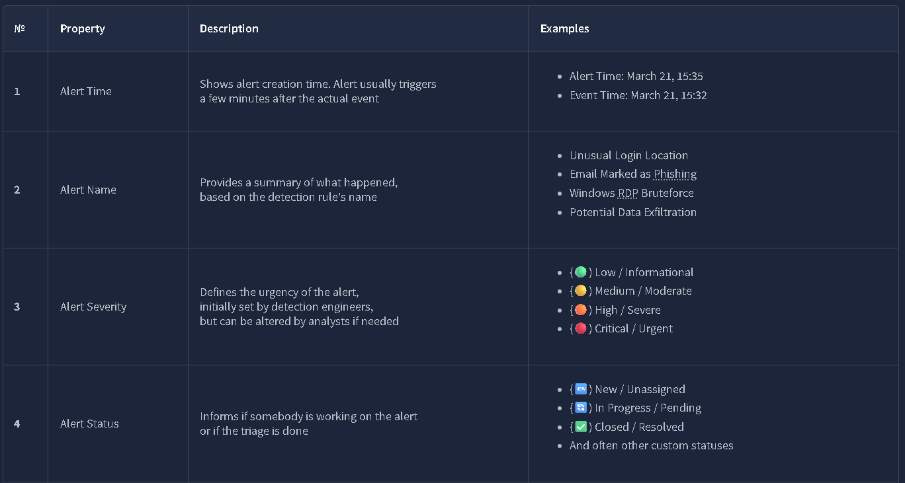
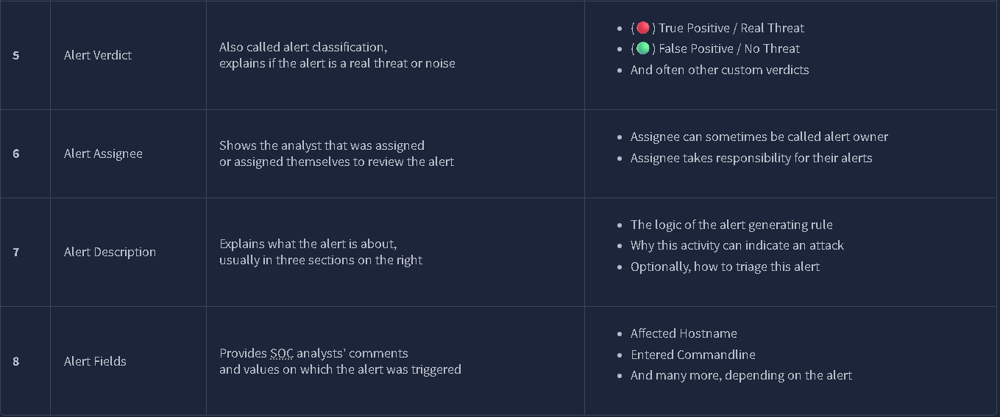

Questions: 

  
**What was the verdict for the "Unusual VPN Login Location" alert?**
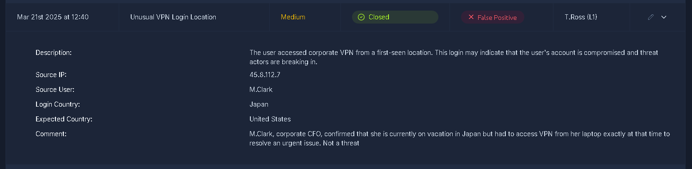
Answer: False Positive

**What user was mentioned in the "Unusual VPN Login Location" alert?**

Answer: M.Clark

## Alert Prioritisation 

**Picking the Right Alert**

Every SOC Team choses it's own prioritisation rules and most commonly used approach:
1. **Filter the alerts**  
    Make sure you don't take the alert that other analysts have already reviewed, or that is already being investigated by one of your teammates. You should only take new, yet unseen and unresolved alerts.
2. **Sort by severity**  
    Start with critical alerts, then high, medium, and finally low. This is because detection engineers design rules so that critical alerts are much more likely to be real, major threats and cause much more impact than medium or low ones.
3. **Sort by time**  
    Start with the oldest alerts and end with the newest ones. The idea is that if both alerts are about two breaches, the hacker from the older breach is likely already dumping your data, while the "newcomer" has just started the discovery.

**Questions**:

Should you first prioritise medium over low severity alerts? (Yea/Nay)
**Answer: Yea**

Should you first take the newest alerts and then the older ones? (Yea/Nay)
**Answer: Nay

Assign yourself to the first-priority alert and change its status to **In Progress**.  The name of your selected alert will be the answer to the question.

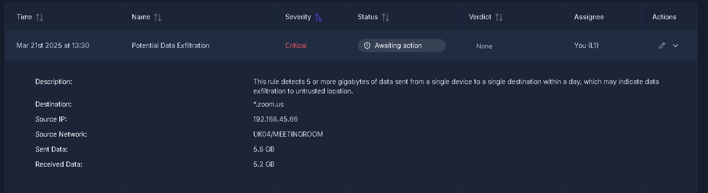

Filter by severity -> Critical 
**Answer: Potential Data Exfiltration

## Alert Triage

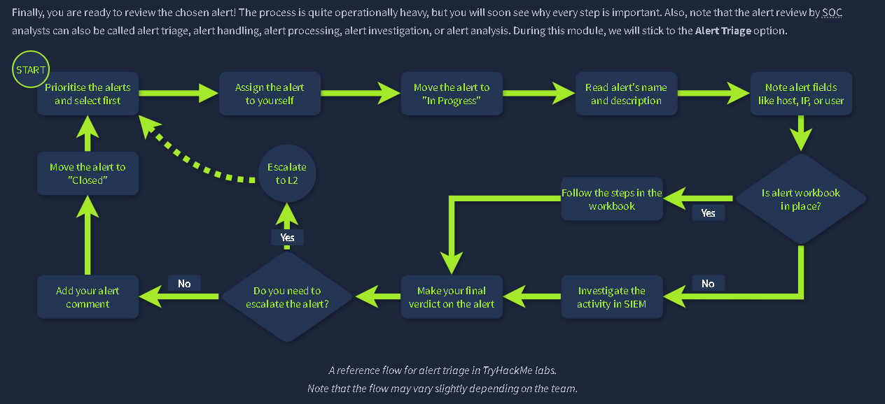

**Initial Actions**
Assigning yourself to the alert -> Move it to In Progress -> Details

**Investigation**
Some teams develop **Workbooks**(also known as playbooks or runbooks).If workbooks are not available, below are some key recommendations:

1. Understand who is under threat, like the affected user, hostname, cloud, network, or website
2. Note the action described in the alert, like whether it was a suspicious login, malware, or phishing
3. Review surrounding events, looking for suspicious actions shortly after or before the alert
4. Use threat intelligence platforms or other available resources to verify your thoughts

**Final Actions**
Your decisions here determine whether you found or missed the potential cyberattack. First, decide if the alert you investigated is malicious (True Positive) or not (False Positive). Then, prepare your detailed comment explaining your analysis steps and verdict reasoning, return to the dashboard and move it to the **Closed** status.

Questions:
**Which flag did you receive after you correctly triaged the first-priority alert?**

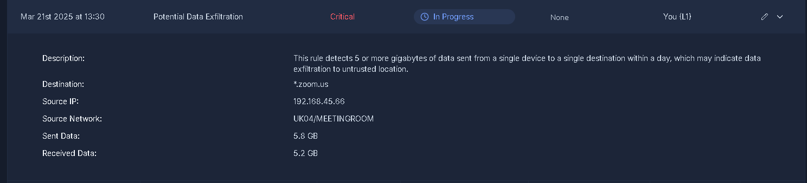

From the description we receive:
This rule detects 5 or more gigabytes of data sent from a single device to a single destination within a day, which may indicate data exfiltration to untrusted location.

First, we need to understand the normal ZOOM call data usage:

The values are close to 5GBs. Which is achievable due to a higher number of users with a Full HD quality. 

We are given the source IP which is 192[.]168[.]45[.]66.
With that we can use a checker to see if the IP is flagged as a fraud or a legitimate source.
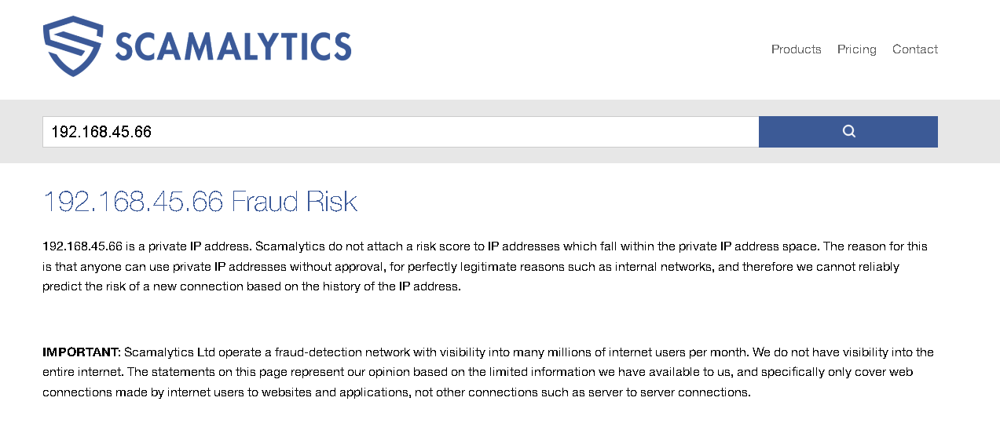

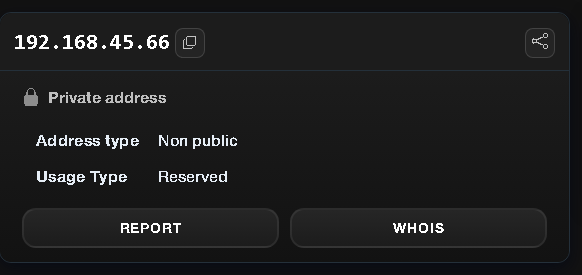
Ip is private, but for the sake of practice, I also went trough the process of verifying it.

The source is UK04/MEETINGROOM, which can mean that an call was happening and also the destination  *.zoom.us* looks legit
That being said, final verdict is: **Flase Positive**.

Flag: THM{looks_like_lots_of_zoom_meetings}

**Which flag did you receive after you correctly triaged the second-priority alert?**

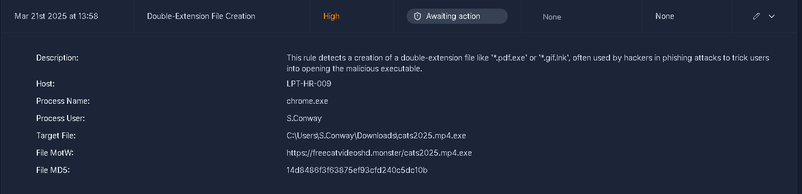
Desc: This rule detects a creation of a double-extension file like '*.pdf.exe' or '*.gif.lnk', often used by hackers in phishing attacks to trick users into opening the malicious executable.

We can see that in  the target file:   
C:\Users\S.Conway\Downloads\cats2025.mp4.exe
Affected user: **S.Conway** 

The extension: .mp4.exe is not a real .mp4 file. It is an executable that is hiding itself into an mp4 file which is a video format.
Source of download: 
https[:]//freecatvideoshd.monster/cats2025.mp4.exe
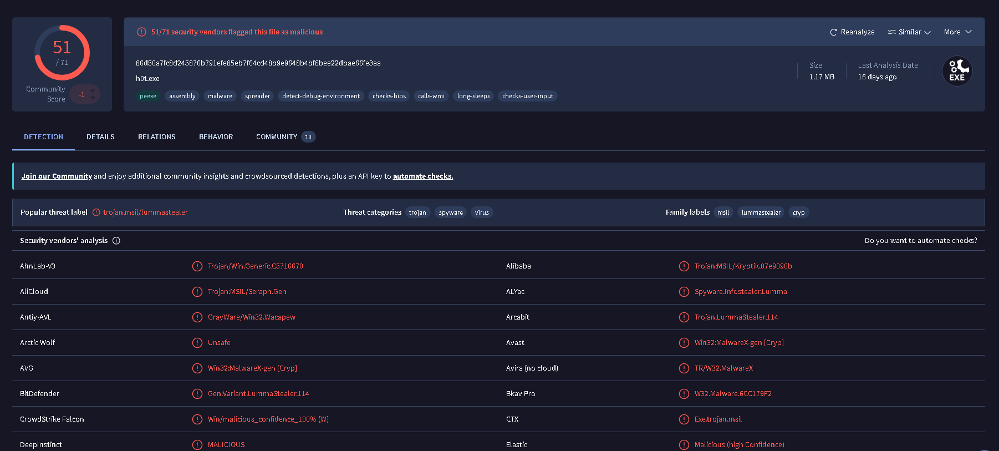
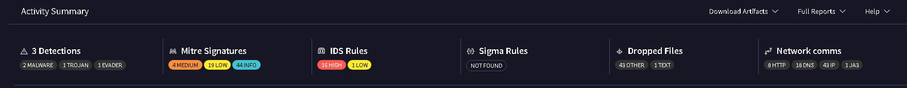
A quick search of the hash reveal a really high score in the virustotal.

Verdict: **True Positive**
Flag: THM{how_could_this_user_fall_for_it?}

**Which flag did you receive after you correctly triaged the third-priority alert?**

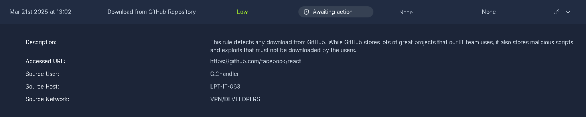
Description:   
This rule detects any download from GitHub. While GitHub stores lots of great projects that our IT team uses, it also stores malicious scripts and exploits that must not be downloaded by the users.

Accessed URL:https[:]//github.com/facebook/react.

When verified, the link changes into https[:]//github.com/react/react which means the original source redirects us here.

Source and details look legitimate => **Flase Positive**.

**Verdict**: Flase positive.
**Flag**: THM{should_we_allow_github_for_devs?}
